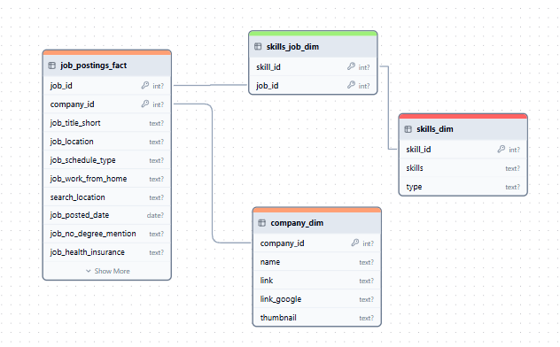
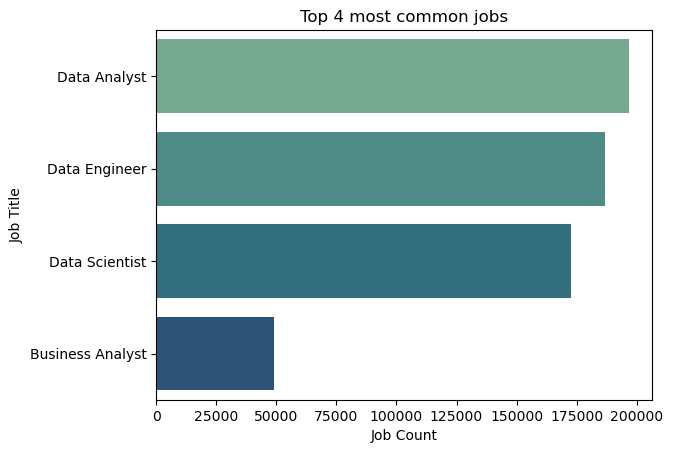
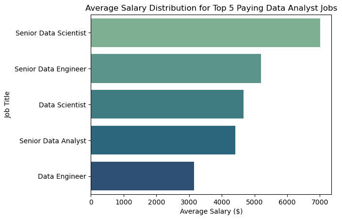
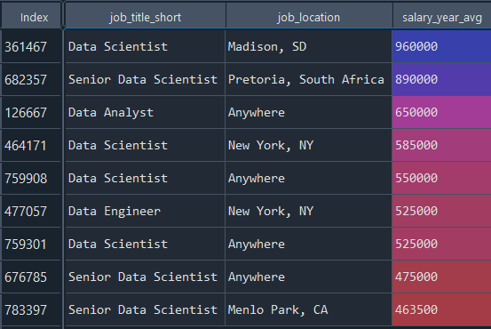
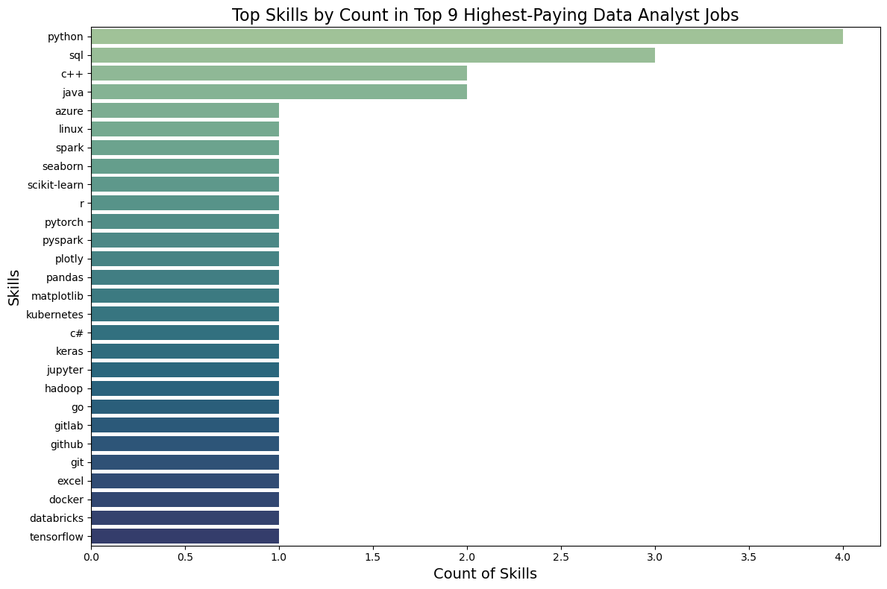
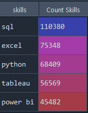
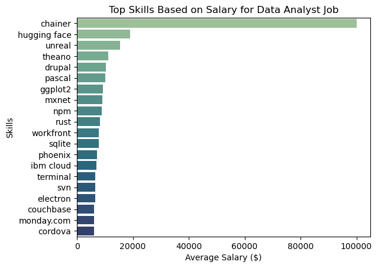
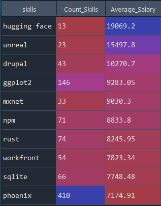

<h1 align="center">
      💼 Jobs Database
      <br /></h1>
<p>This project examines the 2023 data job market, with a focus on Data Analyst positions. It highlights key insights into the highest-paying roles, the most sought-after skills, and the best skills to prioritize for career growth.</p>

<h2>🔎 Case Study Queries</h2>
<ol>
  <li>What are the 4 most common jobs?</li>
  <li>What are the top 5 average paying Data-Related jobs?</li>
  <li>Which locations offered the highest salaries in 2023 for Data-Related jobs, and what job positions were associated with these salaries?</li>
  <li>What skills are required for these top-paying jobs?</li>
  <li>What skills are most in demand for Data Analysts?</li>
  <li>Which skills are associated with higher salaries?</li>
  <li>What are the most optimal skills to learn?</li>
</ol>

<h2>💻 Tool I Used </h2>
<ul>
  <li><b>SQL: </b>Perform queries on the job database.</li>
  <li><b>MySQL: </b>Database management system, perfect for managing job posting data.</li>
  <li><b>Python: </b>Create graph visualizations based on SQL queries.</li>
  <li><b>Spyder: </b>Interactive environment for data analysis and visualization using Python.</li>
  <li><b>GitHub: </b>Version control & Share project results.</li>
</ul>

<h2>ℹ️ Entity Relationship Diagram</h2>


<h2>📊 The Analysis</h2>
<h3>1. Top 4 most common jobs</h3>

```sql
SELECT COUNT(*) AS 'Count Jobs', job_title_short AS 'Job Title'
FROM job_postings_fact
GROUP BY job_title_short
ORDER BY 1 DESC
LIMIT 4;
```

<p>The top four most common job titles in this database, ranked in descending order by the number of queries, are as follows: Data Analyst with 196,593 queries, Data Engineer with 186,677 queries, Data Scientist with 172,726 queries, and finally, Business Analyst with 49,160 queries.</p> <p>Other job titles, such as Software Engineer and Senior Engineer, have fewer queries compared to Business Analyst.</p>


<h3>2. Top 5 average paying Data-Related jobs</h3>

```sql
SELECT job_title_short, AVG(salary_year_avg) AS 'Average Yearly Salary Per Job Title'
FROM job_postings_fact
WHERE salary_year_avg IS NOT NULL
GROUP BY job_title_short
HAVING job_title_short LIKE '%Data%' OR job_title_short LIKE '%Analyst%'
ORDER BY 2 DESC
LIMIT 5;
```

<p>The Senior Data Scientist role has the highest average salary in 2023, with a value of $7,005.29. Following closely is the Senior Data Engineer position, offering an average salary of $5,202.53, followed by the Data Scientist role at $4,663.56, the Senior Data Analyst at $4,410.04, and the Data Engineer position at $3,146.46.</p>
<p>Notably, the top-paying positions in this ranking are predominantly senior roles, highlighting the significant impact of experience on salary levels. This suggests that seniority plays a crucial role in determining salary expectations in the data-related job market.</p>


<h3>3. Top 9 Locations and Job Title with the highest salaries in 2023</h3>

```sql
SELECT job_title_short AS 'Job Title', job_location AS 'City', job_country AS 'Country', salary_year_avg AS 'Average Yearly Salary'
FROM job_postings_fact
WHERE job_title_short LIKE '%Data%' OR job_title_short LIKE '%Analyst%'
ORDER BY salary_year_avg DESC
LIMIT 9;
```

<p>The highest average salary in 2023 is found in Madison, SD, amounting to $960,000 for the position of Data Scientist. This is followed by Pretoria, South Africa, with an average salary of $890,000 for the role of Senior Data Scientist. Remote (Anywhere) positions in India offered $650,000 for Data Analyst roles. Additionally, locations like New York, Remote, and Menlo Park in the United States reported average salaries ranging from $463,500 to $585,000 for positions including Data Scientist, Data Engineer, and Senior Data Scientist.</p>
<p>It is notable that in this top 9 ranking of locations by average annual salary, the United States dominates the list. This highlights the country's strong market for high-paying data-related roles, particularly for senior and technical positions.</p>



<h3>4. Skills required for Top-Paying Data-Related Jobs</h3>

```sql
WITH top_jobs AS (
   SELECT job_id, job_title_short AS 'Job Title', job_location AS 'City', salary_year_avg AS 'Average Yearly Salary'
   FROM job_postings_fact
   WHERE job_title_short LIKE '%Data%' OR job_title_short LIKE '%Analyst%'
   ORDER BY salary_year_avg DESC
   LIMIT 9
),
distinct_id_job AS (
   SELECT top_jobs.*, skills, ROW_NUMBER() OVER (PARTITION BY skills,top_jobs.job_id ORDER BY top_jobs.job_id ASC) AS RowNum
   FROM top_jobs
   INNER JOIN skills_job_dim ON top_jobs.job_id = skills_job_dim.job_id
   INNER JOIN skills_dim ON skills_job_dim.skill_id = skills_dim.skill_id
)
SELECT skills, COUNT(skills) as "Count Skills"
FROM distinct_id_job
WHERE RowNum = 1
GROUP BY skills
ORDER BY 2 DESC;
```

<p>The most common skill among high-paying jobs is the Python programming language, followed by SQL, C++, and Java. Less frequently mentioned are skills like Azure, Linux, Spark, R, Go, Git, and others.</p>
<p>Python and SQL are widely used in fields such as Data Analysis and Data Science, which explains their dominance at the top of the list.</p>


<h3>5. In Demand Skills for Data Analysts</h3>

```sql
SELECT skills, COUNT(DISTINCT job_postings_fact.job_id) AS 'Count Skills'
FROM skills_dim
INNER JOIN skills_job_dim ON skills_dim.skill_id = skills_job_dim.skill_id
INNER JOIN job_postings_fact ON skills_job_dim.job_id = job_postings_fact.job_id
WHERE job_title_short LIKE '%Data Analyst%'
GROUP BY skills
ORDER BY 2 DESC
Limit 5;
````

<p>The most important skills for a Data Analyst job are SQL, Excel, Python, Tableau, and Power BI.</p>
<p>In this database, the skill SQL is associated with 110,380 Data Analyst job postings, followed by Excel with 75,348, Python with 68,409, Tableau with 56,569, and Power BI with 45,482.</p>


<h3>6. Top Skills Based on Salary for Data Analyst Job</h3>

```sql
SELECT skills, ROUND(AVG(salary_year_avg),2) AS 'Average Salary ($)'
FROM skills_dim
INNER JOIN skills_job_dim ON skills_dim.skill_id = skills_job_dim.skill_id
INNER JOIN job_postings_fact ON skills_job_dim.job_id = job_postings_fact.job_id
WHERE job_title_short LIKE '%Data Analyst%' AND salary_year_avg IS NOT NULL
GROUP BY skills
ORDER  BY 2 DESC
LIMIT 20;
````

<p>The most popular skill for a Data Analyst with an average annual salary of $1,000,000 is Chainer.</p>
<p>It is followed by several other skills with a relatively smaller gap in average annual salary (less than $20,000), including Hugging Face, Unreal, Theano, Drupal, Pascal, ggplot2, MXNet, npm, Rust, and more.</p>



<h3>7. Most Optimal Skills for Data Analysts</h3>

```sql
SELECT skills,COUNT(skills_job_dim.skill_id), ROUND(AVG(salary_year_avg),2) AS 'Average Salary ($)'
FROM skills_dim
INNER JOIN skills_job_dim ON skills_dim.skill_id = skills_job_dim.skill_id
INNER JOIN job_postings_fact ON skills_job_dim.job_id = job_postings_fact.job_id
WHERE job_title_short LIKE '%Data Analyst%' AND salary_year_avg IS NOT NULL
GROUP BY skills
HAVING  COUNT(skills_job_dim.skill_id) > 10
ORDER BY 3 DESC
LIMIT 10;
```

<p>The most optimal skills for data analysts include Hugging Face, Unreal, Drupal, ggplot2, MXNet, npm, Rust, Workfron, SQLite, Pheonix.</p>


<h2>📍 Conclusion</h2>
<p>From the analysis, several general insights emerged:</p>
<ol>
<li><b>Top 4 Most Common Jobs:</b> The most common jobs in the data field are Data Analyst, Data Engineer, Data Scientist, and Business Analyst.</li>
<li><b>Top 5 Highest Paying Data-Related Jobs:</b> Senior-level data-related roles have the highest average salaries.</li>
<li><b>Top 9 Locations and Job Titles with the Highest Salaries in 2023:</b> Madison, SD offers the highest average salary in 2023, with Data Scientist positions earning around $960,000. The United States dominates the list of top locations by average annual salary.</li>
<li><b>Skills Required for Top-Paying Data-Related Jobs:</b> The most sought-after skills in high-paying data-related jobs include Python, SQL, C++, and Java.</li>
<li><b>Key Skills for Data Analysts:</b> The essential skills for a Data Analyst role are SQL, Excel, Python, Tableau, and Power BI.</li>
<li><b>Top Skills Based on Salary for Data Analysts:</b> Chainer is the most popular skill for Data Analysts with high salaries, followed by Hugging Face, Unreal, Theano, Drupal, Pascal, ggplot2, MXNet, npm, Rust, and others.</li>
<li><b>Most Optimal Skills for Data Analysts:</b> The most optimal skills for Data Analysts include Hugging Face, Unreal, Drupal, ggplot2, MXNet, npm, Rust, Workfront, SQLite, and Phoenix.</li>
</ol>
